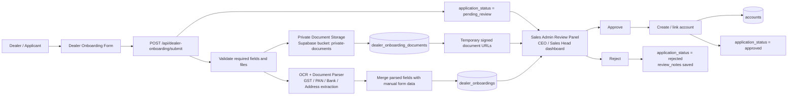
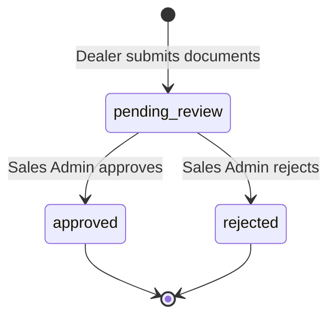

# Dealer Onboarding Architecture

## Component Responsibilities

- **Dealer Onboarding Form**: Collects dealer business details and original documents.
- **Submit API**: Validates files, saves originals, runs OCR where supported, and creates the onboarding application.
- **Private Document Storage**: Stores uploaded documents unchanged in the existing private-document workflow.
- **OCR + Parser**: Extracts GSTIN, PAN, address, phone, email, IFSC, bank account, and related fields from image documents.
- **dealer_onboardings**: Main application record and review state.
- **dealer_onboarding_documents**: One row per uploaded document with storage path, OCR status, OCR text, and parsed fields.
- **Sales Admin Review Panel**: Review queue for CEO/Sales Head style admin users to inspect documents and OCR-populated data.
- **Review API**: Approves or rejects an application.
- **accounts**: Created/linked when Sales Admin approves the dealer.

## Status Flow

## Notes

- Image files are OCR processed.
- PDF files are preserved in storage and can be reviewed from the panel; PDF OCR can be added as a later enhancement.
- Review document links should be generated as short-lived signed URLs from private storage.
